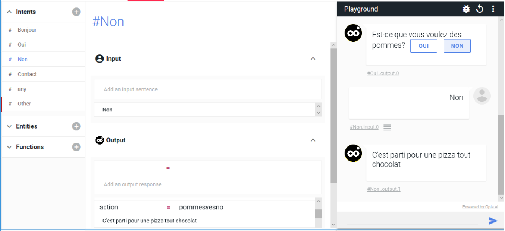

    #Non  
    Input : non  
    Output:  
    action=pommesyesno 
    C'est parti pour une pizza tout chocolat! 

 

Ne pas oublier de cliquer sur SAVE avant d'essayer le schéma dans le playground.

Puis nous allons rajouter la branche de droite, 

    #Non 
    Input : non 
    Output :  
    action=sweetyesno 
    Voulez-vous des champignons ?
    [Oui][Non]<action=mushroomsyesno>

    #Oui 
    Input : oui 
    Output : 
    action = mushroomsyesno 
    C'est parti pour une Reine

    #Non 
    Input : non 
    Output : 
    action=mushroomsyesno 
    C'est parti pour une trois fromages !

Et voilà,  votre premier schéma de conversation est paramétré ! Passons maintenant à un exemple suivant, l'exemple de la prise de contact, qui gère des saisies manuelles effectuées par l'utilisateur.

<a href="En-francais5.html" class="previous">&laquo; Previous</a>
<a href="En-francais7.html" class="next">Next &raquo;</a>

